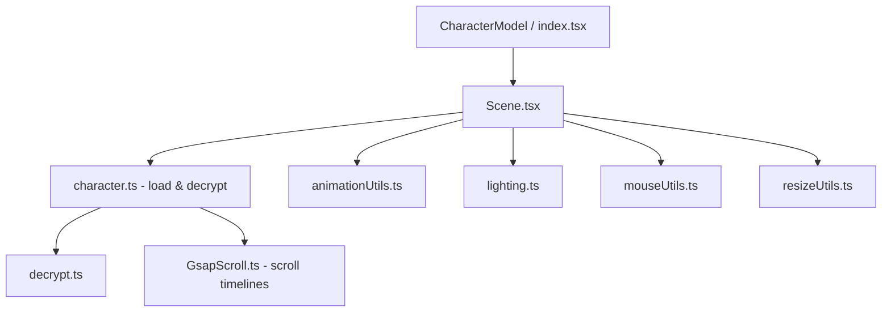
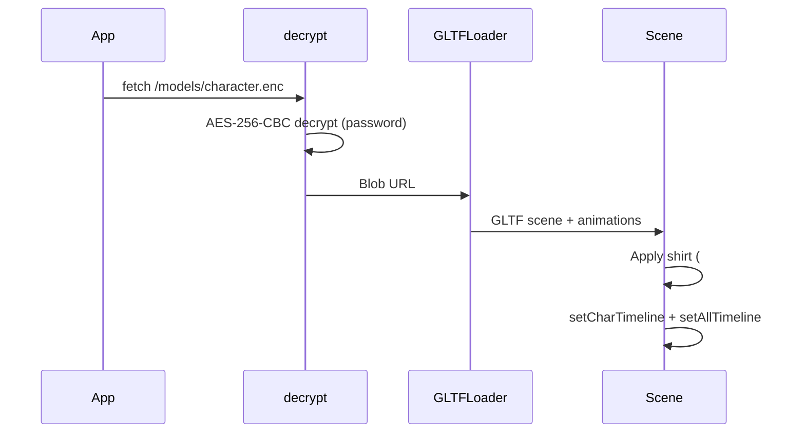

# 3D Character System

The 3D character is the desktop centerpiece — an animated GLB model that reacts to mouse movement and scroll position.

## Component Structure

## Files

| File | Responsibility |
|------|----------------|
| `Character/index.tsx` | Thin wrapper exporting `Scene` |
| `Character/Scene.tsx` | Three.js renderer, camera, animation loop, event listeners |
| `utils/character.ts` | Decrypt model, load GLB, apply materials, init scroll timelines |
| `utils/animationUtils.ts` | Intro, typing, blink, eyebrow hover animations |
| `utils/lighting.ts` | Directional/point lights, HDR environment, light fade-in |
| `utils/mouseUtils.ts` | Head rotation from mouse/touch input |
| `utils/resizeUtils.ts` | Canvas resize + ScrollTrigger refresh |
| `utils/decrypt.ts` | AES-256-CBC client-side decryption |
| `data/boneData.ts` | Bone names for typing and eyebrow animations |

## Model Loading Flow

## Encryption

| Item | Detail |
|------|--------|
| Encrypted file | `public/models/character.enc` |
| Decrypted file | `public/models/character.glb` (local only) |
| Algorithm | AES-256-CBC |
| Key derivation | SHA-256 of password, first 32 bytes |
| Password | `MyCharacter12` |
| IV | First 16 bytes of encrypted file |

## Animations

| Animation | Trigger | Bones / Clips |
|-----------|---------|---------------|
| Intro | On model load complete | `introAnimation` clip |
| Typing | Continuous loop | `typing` clip + `typingBoneNames` |
| Keyboard keys | Continuous loop | `key1`, `key2`, `key5`, `key6` |
| Blink | 2.5s after intro | `Blink` clip |
| Eyebrow raise | Mouse hover on face | `browup` + `eyebrowBoneNames` |
| Head follow | Mouse/touch on landing | `spine006` bone rotation |

## Scroll-Driven Behavior (`GsapScroll.ts`)

On desktop, scroll position drives character and camera:

| Scroll Section | Character behavior |
|----------------|-----------------|
| Landing | Character rotates, moves left, landing text fades |
| About | Camera zooms out, monitor screen lights up |
| What I Do | Character moves up and off-screen |

## Lighting

- **Directional light** — shadows, fades in after load
- **Point light** — follows screen emissive intensity
- **HDR environment** — `char_enviorment.hdr`, rotation and intensity animated
- **Screen light** — `screenlight` mesh on character monitor, flickers randomly

## Responsive Behavior

| Viewport | Character placement | Head tracking |
|----------|--------------------|--------------|
| Desktop | Fixed side panel | Active while scrollY < 200 |
| Mobile | Inside landing hero | Touch-based on `#landingDiv` |
| After scroll | Head resets to default pose | Desktop only |
