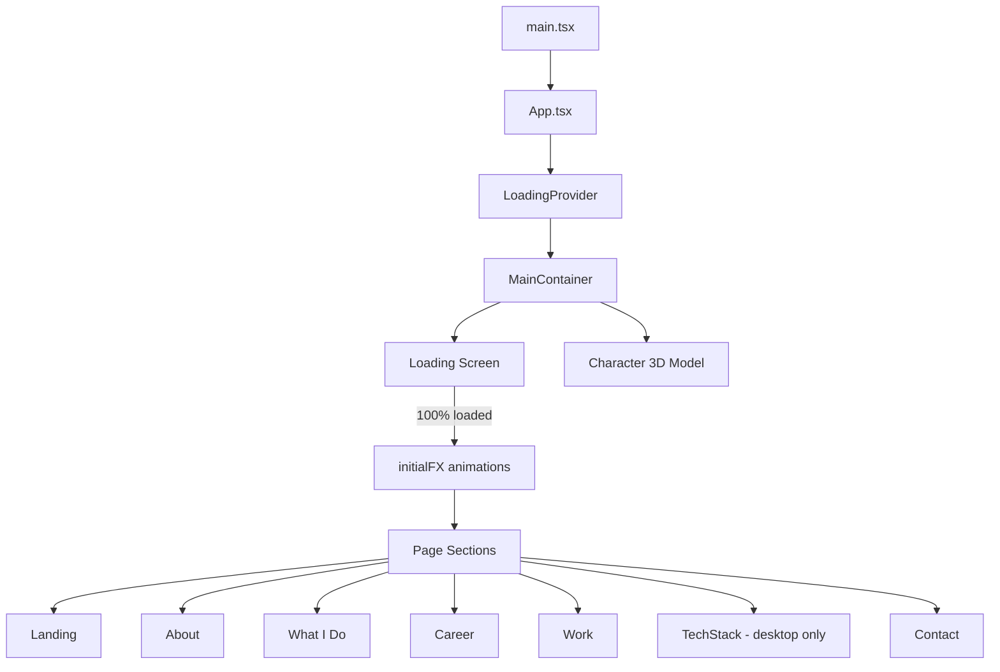
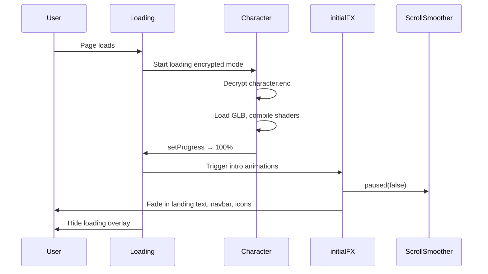
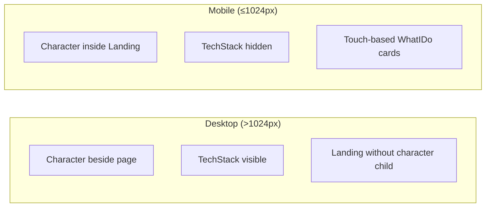

# Application Flow

## High-Level Flow Diagram

## Boot Sequence

### Step-by-step

1. **`LoadingProvider`** wraps the app and shows a loading screen until the 3D model is ready.
2. **`Loading.tsx`** simulates progress via `setProgress()`, then completes when the model loads.
3. On 100%, **`initialFX()`** runs intro animations (SplitText, looping titles, navbar fade-in).
4. **ScrollSmoother** is unpaused and smooth scrolling becomes active.

## Layout Logic (`MainContainer.tsx`)

| Viewport | Character position | TechStack | WhatIDo interaction |
|----------|-------------------|-----------|---------------------|
| > 1024px | Side panel (sibling of scroll content) | Shown | Hover (desktop) |
| ≤ 1024px | Inside `Landing` as children | Hidden | Tap to expand cards |

## Scroll System (`Navbar.tsx`)

- Uses GSAP **ScrollSmoother** on `#smooth-wrapper` / `#smooth-content`.
- Smooth factor: `1.7`
- Starts **paused** until loading completes.
- Nav links use `data-href` and `smoother.scrollTo()` on desktop.
- Targets: `#about`, `#work`, `#contact`.

## Responsive Breakpoints

| Breakpoint | Behavior |
|------------|----------|
| > 1600px | Section container: 1200px |
| > 1400px | Section container: 900px |
| > 1024px | Desktop layout (character side panel, TechStack) |
| > 900px | SplitText scroll animations enabled |
| ≤ 900px | SplitText disabled; smaller TechStack heading |
| ≤ 900px (mobile) | Section container: 500px / `--cWidth` |
